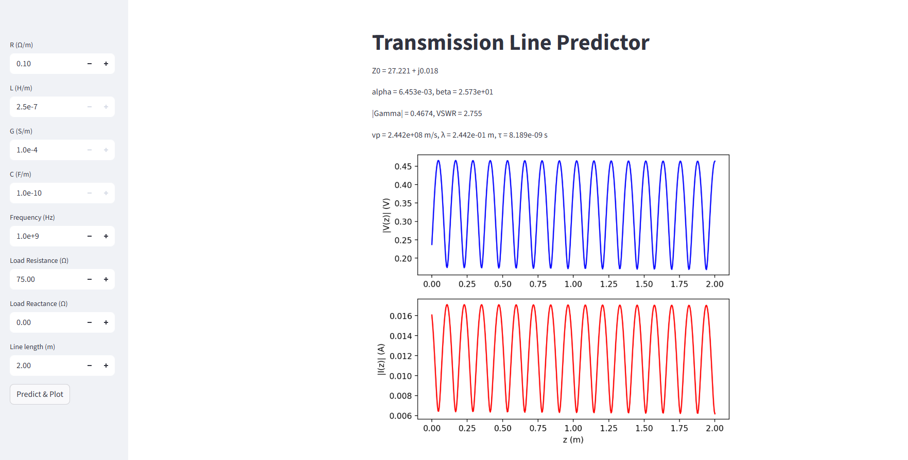

# Transmission Line Analysis with Machine Learning

This project implements **machine learning–based transmission line analysis**.  
It predicts the **fundamental transmission line parameters** from physical inputs and reconstructs derived parameters analytically.  
A **Streamlit interface** is provided for interactive analysis and visualization of voltage and current standing waves.  

---

## 📌 Features
- Compute **fundamental parameters**:  
  - Characteristic impedance Z0​  
  - Attenuation constant 𝛼 
  - Phase constant β  

- Compute **derived parameters** (from fundamentals):  
  - Reflection coefficient (Γ)  
  - Input impedance (Z_in)  
  - VSWR  
  - Propagation velocity (v_p)  
  - Wavelength (λ)  
  - Time delay (𝜏)  

- **Machine Learning Model**  
  - PyTorch MLP trained on synthetic dataset (2000+ samples).  
  - Input: [R, L, G, C, f, ℜ(ZL​), ℑ(ZL)].  
  - Output: [Z0_real, Z0_imag, α, β].  
  - Accuracy: R² ≈ 0.95+ across test data.  

- **Interactive Interface (Streamlit)**  
  - Sidebar for user input.  
  - Displays predicted fundamentals and derived parameters.  
  - Plots voltage & current standing waves.  

---

## ⚙️ Installation

Clone the repo and install dependencies:

```bash
git clone https://github.com/your-username/txline-ml.git
cd txline-ml
pip install -r requirements.txt
```
- **Dependencies:**

   - Python 3.8+
   - PyTorch
   - scikit-learn
   - numpy, matplotlib
   - streamlit
   - joblib
   - 
If needed, install manually:

```bash
pip install torch scikit-learn numpy matplotlib streamlit joblib
```

## 🖼️ Streamlit Interface


---

## 📊 Results

- Fundamentals prediction (R² on test set):

    - Z0_real = 0.957
    - Z0_imag = 0.903
    - α = 0.967
    - β = 0.992
  
- Standing wave plots show close agreement between true and predicted parameters.

---

## 📌 Future Work

- Improve stability of Z0_imag predictions.
- Add PDF/CSV export to Streamlit interface.
- Extend dataset with more frequency variations.
  
----
